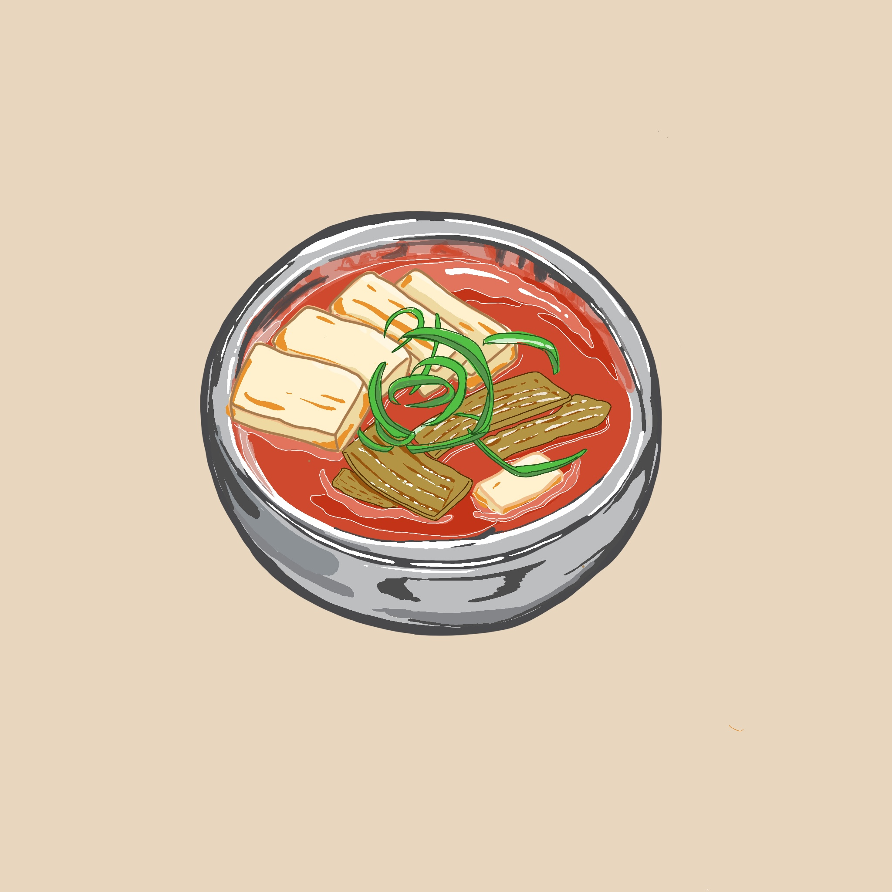

  <b>website:</b> <a href= "https://www.mandudc.com/">mandudc.com</a>
   
  <b>how to get it:</b> takeout or get it delivered <a href= "https://www.trycaviar.com/m/mandu--k-street-3379">here</a>
   
  <b>what it is:</b> family-run, homey Korean fare

Kimchi JJigae or kimchi stew is made with kimchi, a salted and fermented napa cabbage. It is commonly made with tofu, scallions, pork, tuna, or seafood.

Mandu has started a staff relief gofundme for there restaurant staff and workers. You can access the link [here](https://www.gofundme.com/f/mandu-k-street-employee-relief-fund-covid19?utm_source=customer&utm_medium=copy_link-tip&utm_campaign=p_cp+share-sheet) to help them out.
